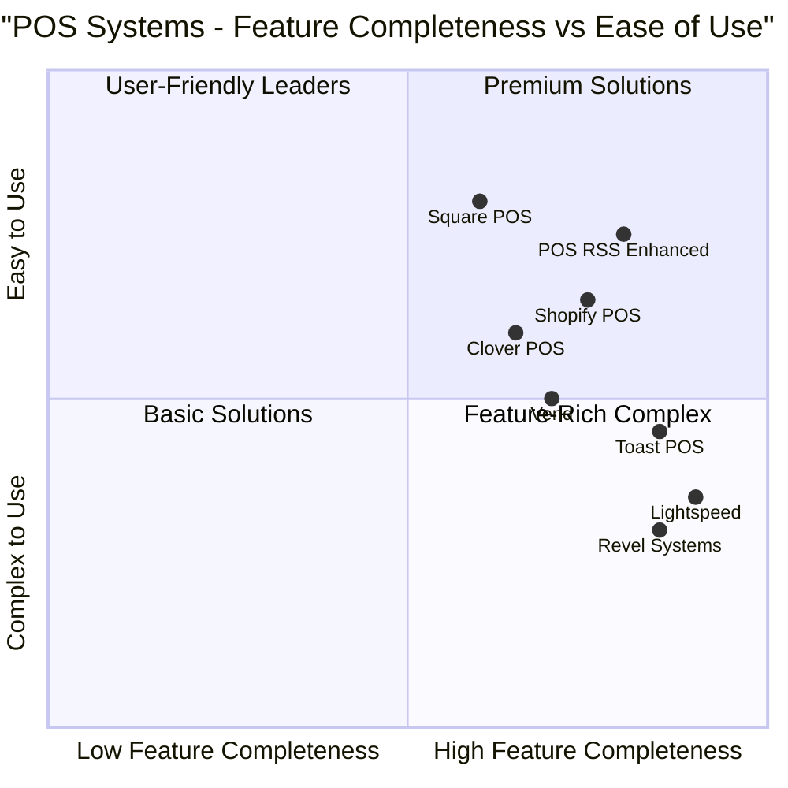

# Product Requirement Document (PRD)
# POS RSS Enhancement - Inventory Management & BOM System

## 1. Informasi Proyek

**Bahasa:** Bahasa Indonesia  
**Bahasa Pemrograman:** Flask, SQLAlchemy, Bootstrap, JavaScript  
**Nama Proyek:** pos_rss_enhancement  
**Kebutuhan Asli:** Enhancement sistem POS RSS dengan fitur manajemen inventori yang lebih fleksibel, sistem BOM (Bill of Materials), dan perbaikan chart di laporan

## 2. Definisi Produk

### 2.1 Tujuan Produk

1. **Fleksibilitas Manajemen Stok**: Memberikan opsi kepada tenant untuk memilih produk mana yang perlu tracking stok dan mana yang tidak (seperti makanan/minuman yang tidak memerlukan tracking inventori detail)

2. **Sistem BOM Terintegrasi**: Mengimplementasikan sistem Bill of Materials yang memungkinkan produk dibuat dari kombinasi bahan baku dengan perhitungan otomatis pengurangan stok bahan baku

3. **Marketplace yang Lebih Cerdas**: Membedakan antara pembelian "Produk Jadi" dan "Bahan Baku" di marketplace dengan alur stok yang berbeda untuk masing-masing jenis

### 2.2 User Stories

**US-001: Sebagai Tenant Manager**  
Saya ingin dapat mengatur apakah suatu produk perlu tracking stok atau tidak, sehingga produk seperti makanan/minuman yang tidak memerlukan tracking inventori detail tidak mengganggu laporan stok.

**US-002: Sebagai Tenant Manager**  
Saya ingin dapat mengaktifkan fitur BOM untuk produk tertentu dan mendefinisikan bahan baku apa saja yang dibutuhkan, sehingga ketika produk tersebut terjual, stok bahan baku akan berkurang secara otomatis sesuai resep.

**US-003: Sebagai Tenant**  
Saya ingin dapat membeli bahan baku dari marketplace yang langsung masuk ke inventory bahan baku (bukan ke POS), sehingga bahan baku tersebut bisa digunakan untuk produksi produk dengan BOM.

**US-004: Sebagai Tenant**  
Saya ingin dapat membeli produk jadi dari marketplace yang langsung menambah stok di POS, sehingga produk tersebut bisa langsung dijual kepada customer.

**US-005: Sebagai Cashier**  
Saya ingin dapat melihat chart laporan yang interaktif termasuk tombol jumlah transaksi yang bisa diklik, sehingga saya dapat menganalisis data penjualan dengan lebih detail.

### 2.3 Analisis Kompetitor

| Kompetitor | Kelebihan | Kekurangan |
|------------|-----------|------------|
| **Shopify POS** | - Sistem inventory yang fleksibel<br>- Tracking stok opsional<br>- Integrasi marketplace yang baik | - Tidak ada sistem BOM built-in<br>- Mahal untuk fitur advanced<br>- Kompleks untuk UKM |
| **Square POS** | - Interface yang user-friendly<br>- Laporan yang interaktif<br>- Sistem kategori produk yang baik | - BOM terbatas<br>- Tidak ada pembedaan bahan baku<br>- Biaya transaksi tinggi |
| **Toast POS** | - Khusus untuk F&B<br>- Sistem resep/BOM yang baik<br>- Manajemen bahan baku | - Terbatas pada industri F&B<br>- Tidak ada marketplace internal<br>- Mahal |
| **Lightspeed** | - Sistem inventory yang advanced<br>- Multi-location support<br>- Laporan yang detail | - Tidak ada sistem BOM<br>- Interface yang kompleks<br>- Tidak ada marketplace terintegrasi |
| **Vend (Lightspeed Retail)** | - Inventory management yang kuat<br>- Sistem kategori yang fleksibel<br>- Cloud-based | - Tidak ada BOM system<br>- Fokus pada retail, bukan F&B<br>- Biaya bulanan tinggi |
| **Revel Systems** | - All-in-one solution<br>- Inventory tracking yang detail<br>- Multi-platform | - Kompleks untuk setup<br>- Tidak ada marketplace internal<br>- Mahal untuk small business |
| **Clover POS** | - Hardware terintegrasi<br>- App marketplace yang luas<br>- Inventory management | - BOM hanya via third-party apps<br>- Tergantung pada hardware Clover<br>- Biaya processing fee |

### 2.4 Competitive Quadrant Chart



## 3. Spesifikasi Teknis

### 3.1 Analisis Kebutuhan

Berdasarkan analisis kode yang ada, sistem POS RSS saat ini memiliki:

**Struktur Database Existing:**
- `Product`: Manajemen produk dengan tracking stok standar
- `MarketplaceItem`: Item yang dijual di marketplace
- `RestockOrder`: Order restock dari marketplace ke tenant
- `Sale` & `SaleItem`: Transaksi penjualan

**Kebutuhan Enhancement:**
1. **Flexible Stock Tracking**: Menambah field `requires_stock_tracking` pada model Product
2. **BOM System**: Model baru untuk BOM, BOMItem, dan RawMaterial
3. **Enhanced Marketplace**: Menambah field `item_type` pada MarketplaceItem
4. **Improved Reports**: Perbaikan JavaScript untuk chart interaktivity

### 3.2 Requirements Pool

#### P0 Requirements (Must Have)

**REQ-001: Flexible Stock Tracking**
- Product MUST memiliki opsi untuk enable/disable stock tracking
- Produk dengan stock tracking disabled MUST tidak mengurangi stok saat dijual
- Produk dengan stock tracking disabled MUST tidak muncul di laporan low stock

**REQ-002: Raw Materials Management**
- Sistem MUST memiliki model RawMaterial terpisah dari Product
- Raw materials MUST memiliki unit, stok, dan harga cost
- Raw materials MUST dapat dibeli dari marketplace

**REQ-003: BOM System Core**
- Product MUST memiliki opsi untuk enable/disable BOM
- BOM MUST dapat mendefinisikan raw materials dan quantity yang dibutuhkan
- Saat produk dengan BOM terjual, raw materials MUST berkurang sesuai BOM

**REQ-004: Marketplace Item Type**
- MarketplaceItem MUST memiliki field item_type (product/raw_material)
- Pembelian "product" MUST menambah stok di Product
- Pembelian "raw_material" MUST menambah stok di RawMaterial

#### P1 Requirements (Should Have)

**REQ-005: BOM Validation**
- Sistem SHOULD memvalidasi ketersediaan raw materials sebelum penjualan
- Sistem SHOULD memberikan warning jika raw materials tidak cukup
- Sistem SHOULD mencegah penjualan jika raw materials habis (configurable)

**REQ-006: Enhanced Reporting**
- Chart SHOULD memiliki tombol yang clickable untuk drill-down
- Laporan SHOULD menampilkan usage raw materials
- Laporan SHOULD menampilkan cost analysis untuk produk dengan BOM

**REQ-007: Inventory Alerts**
- Sistem SHOULD memberikan alert untuk raw materials yang hampir habis
- Sistem SHOULD memberikan rekomendasi restock berdasarkan BOM usage

#### P2 Requirements (Nice to Have)

**REQ-008: BOM Cost Calculation**
- Sistem MAY menghitung cost produk berdasarkan cost raw materials
- Sistem MAY memberikan analisis profit margin real-time
- Sistem MAY memberikan rekomendasi pricing berdasarkan BOM cost

**REQ-009: Advanced BOM Features**
- BOM MAY mendukung nested BOM (BOM dalam BOM)
- BOM MAY mendukung alternative raw materials
- BOM MAY mendukung batch production

### 3.3 UI Design Draft

#### 3.3.1 Product Form Enhancement
```
[Product Form]
┌─────────────────────────────────────┐
│ Product Name: [________________]    │
│ Description:  [________________]    │
│ Price:        [________________]    │
│                                     │
│ ☑ Requires Stock Tracking           │
│ └─ Stock Quantity: [_____] (if ☑)   │
│ └─ Stock Alert:    [_____] (if ☑)   │
│                                     │
│ ☐ Enable BOM (Bill of Materials)    │
│ └─ [BOM Configuration] (if ☑)       │
│                                     │
│ [Save] [Cancel]                     │
└─────────────────────────────────────┘
```

#### 3.3.2 BOM Configuration Interface
```
[BOM Configuration for: Product Name]
┌─────────────────────────────────────┐
│ Raw Materials Required:             │
│                                     │
│ ┌─ Raw Material 1 ─────────────────┐│
│ │ Material: [Dropdown ▼]          ││
│ │ Quantity: [____] Unit: [____]   ││
│ │ [Remove]                        ││
│ └─────────────────────────────────┘│
│                                     │
│ [+ Add Raw Material]                │
│                                     │
│ Total Estimated Cost: $XX.XX        │
│ [Save BOM] [Cancel]                 │
└─────────────────────────────────────┘
```

#### 3.3.3 Marketplace Item Type Selection
```
[Create Marketplace Item]
┌─────────────────────────────────────┐
│ Item Name: [____________________]   │
│ Description: [__________________]   │
│ Price: [_______]                    │
│                                     │
│ Item Type:                          │
│ ○ Product (Ready to Sell)           │
│ ○ Raw Material (For Production)     │
│                                     │
│ [Save] [Cancel]                     │
└─────────────────────────────────────┘
```

### 3.4 Database Schema Changes

#### 3.4.1 Enhanced Product Model
```sql
-- Add columns to existing products table
ALTER TABLE products ADD COLUMN requires_stock_tracking BOOLEAN DEFAULT TRUE;
ALTER TABLE products ADD COLUMN has_bom BOOLEAN DEFAULT FALSE;
ALTER TABLE products ADD COLUMN bom_cost DECIMAL(10,2) DEFAULT 0;
```

#### 3.4.2 New Raw Materials Model
```sql
CREATE TABLE raw_materials (
    id VARCHAR(36) PRIMARY KEY,
    name VARCHAR(200) NOT NULL,
    description TEXT,
    sku VARCHAR(100) UNIQUE,
    unit VARCHAR(20) DEFAULT 'kg',
    cost_price DECIMAL(10,2),
    stock_quantity INTEGER DEFAULT 0,
    stock_alert INTEGER DEFAULT 10,
    is_active BOOLEAN DEFAULT TRUE,
    tenant_id VARCHAR(36) NOT NULL,
    created_at DATETIME DEFAULT CURRENT_TIMESTAMP,
    updated_at DATETIME DEFAULT CURRENT_TIMESTAMP ON UPDATE CURRENT_TIMESTAMP,
    FOREIGN KEY (tenant_id) REFERENCES tenants(id)
);
```

#### 3.4.3 BOM Models
```sql
CREATE TABLE bom_headers (
    id VARCHAR(36) PRIMARY KEY,
    product_id VARCHAR(36) NOT NULL,
    version INTEGER DEFAULT 1,
    is_active BOOLEAN DEFAULT TRUE,
    notes TEXT,
    created_at DATETIME DEFAULT CURRENT_TIMESTAMP,
    FOREIGN KEY (product_id) REFERENCES products(id)
);

CREATE TABLE bom_items (
    id VARCHAR(36) PRIMARY KEY,
    bom_header_id VARCHAR(36) NOT NULL,
    raw_material_id VARCHAR(36) NOT NULL,
    quantity DECIMAL(10,3) NOT NULL,
    unit VARCHAR(20),
    notes TEXT,
    FOREIGN KEY (bom_header_id) REFERENCES bom_headers(id),
    FOREIGN KEY (raw_material_id) REFERENCES raw_materials(id)
);
```

#### 3.4.4 Enhanced Marketplace Model
```sql
-- Add column to existing marketplace_item table
ALTER TABLE marketplace_item ADD COLUMN item_type ENUM('product', 'raw_material') DEFAULT 'product';
ALTER TABLE marketplace_item ADD COLUMN target_model VARCHAR(20) DEFAULT 'product';
```

### 3.5 Open Questions

1. **BOM Complexity**: Apakah sistem perlu mendukung nested BOM (produk yang menggunakan produk lain sebagai bahan baku)?

2. **Raw Material Units**: Apakah perlu konversi unit otomatis (misal: kg ke gram) atau cukup manual input?

3. **Stock Validation**: Ketika raw material tidak cukup untuk BOM, apakah sistem harus:
   - Mencegah penjualan sama sekali?
   - Memberikan warning tapi tetap allow?
   - Memberikan opsi partial fulfillment?

4. **Marketplace Integration**: Apakah perlu approval workflow untuk raw materials yang dibeli dari marketplace sebelum masuk ke inventory?

5. **Cost Calculation**: Apakah BOM cost harus update real-time saat raw material cost berubah, atau snapshot saat BOM dibuat?

6. **Multi-tenant Raw Materials**: Apakah raw materials bisa di-share antar tenant atau strictly isolated per tenant?

7. **Chart Interactivity**: Untuk perbaikan chart, drill-down yang diinginkan sampai level apa? (daily → hourly, atau product-wise breakdown?)

## 4. Implementation Roadmap

### Phase 1: Core Infrastructure (2 weeks)
- Database schema migration
- Basic models untuk RawMaterial, BOM
- Enhanced Product model dengan stock tracking option

### Phase 2: BOM System (3 weeks)  
- BOM CRUD operations
- BOM calculation logic
- Integration dengan sales process

### Phase 3: Marketplace Enhancement (2 weeks)
- Item type differentiation
- Enhanced restock flow untuk raw materials
- Updated UI untuk marketplace

### Phase 4: Reporting & UI Polish (1 week)
- Chart interactivity fixes
- Enhanced reporting dengan BOM data
- UI/UX improvements

### Phase 5: Testing & Optimization (1 week)
- Comprehensive testing
- Performance optimization
- Documentation update

**Total Estimated Timeline: 9 weeks**

## 5. Success Metrics

1. **Adoption Rate**: 70% tenant menggunakan minimal satu fitur baru dalam 3 bulan
2. **Inventory Accuracy**: Pengurangan 50% complaint tentang stock discrepancy
3. **User Satisfaction**: Rating 4.5/5 untuk fitur BOM dari tenant F&B
4. **Performance**: Chart loading time < 2 detik
5. **Error Reduction**: 80% pengurangan error terkait stock management

---

*Dokumen ini akan diupdate seiring dengan feedback dan development progress.*